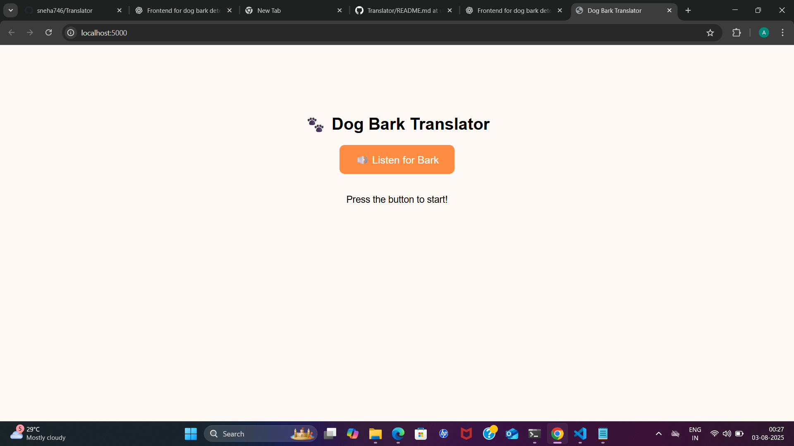

# dog bark translator 🎯

## Basic Details
### Team Name: [code comets]

### Team Members
- Team Lead: [sneha t] - [college of engineering attingal]
- Member 2: [adithya] - [College of engineering attingal]
- Member 3: [Name] - [College]

### Project Description
A website to detect the sound of a dog barking and displying some creative and funny commands as reply

### The Problem (that doesn't exist)
Dogs bark all the time, but what are they really trying to say? Are they warning us of impending doom... or just hungry again? For centuries, humans have struggled to decode the mysterious woofs and ruffs of our four-legged companions. We decided it’s time to stop guessing and start translating.

### The Solution (that nobody asked for)
We built a Dog Bark Translator – a groundbreaking, scientifically questionable, completely unnecessary web app that listens to barks and translates them into ridiculous, randomly generated messages.

## Technical Details
### Technologies/Components Used
For Software:
- python,html
- flask
- pyaudio,numpy,random,wave
- html/css/javascript,fetch API,python

For Hardware:
- laptop

### Implementation
For Software:python,flask,pyaudio,numpy,html/css/javascript,web browser
# Installation
pip install numpy, pip install flask,pip install pyaudio

# Run
python app.py,Running on http://127.0.0.1:5000

### Project Documentation
For Software:

# Screenshots (Add at least 3)

*this is the webpage we created to translate dogs barking sound into creative and funny commands

when no barking sound is detected then command like "no sound detected,try again"will display

when barking sound is detected,creative or funny commands will display like this

# Diagrams

*Add caption explaining your workflow*

For Hardware:

# Schematic & Circuit

*Add caption explaining connections*

*Add caption explaining the schematic*

# Build Photos

*List out all components shown*

*Explain the build steps*

*Explain the final build*

### Project Demo
# Video
<video controls src="https://github.com/sneha746/Translator/blob/main/Screen%20Recording%202025-08-03%20012226.mp4" title="[Add your demo video link here]"></video>
here when no audio is detected "no sound detected,try again"will display and when sound get detected a command will be detected

# Additional Demos
[Add any extra demo materials/links]

## Team Contributions
- [Sneha T]: [Specific contributions]
- [Adithya]: [Specific contributions]
- [Name 3]: [Specific contributions]

---
Made with ❤️ at TinkerHub Useless Projects 

